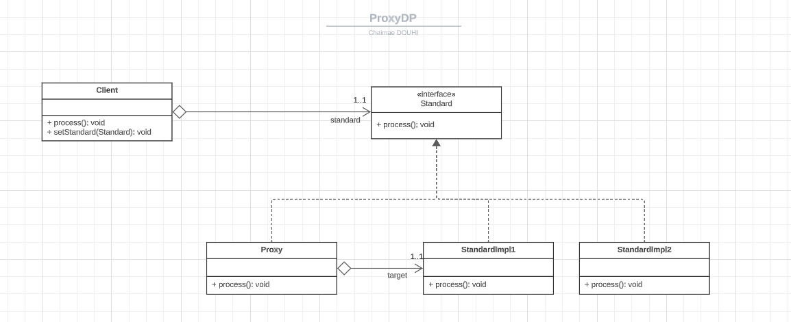

### Proxy Pattern
#### Definition
The proxy pattern is a structural design pattern that lets you provide a substitute or placeholder for another object. A proxy controls access to the original object, allowing you to perform something either before or after the request gets through to the original object.

#### Problem
You have a massive object that consumes a vast amount of system resources. You need it from time to time, but not always.

#### Solution
Create a proxy object that acts as a middleman between a client and a service object, redirecting requests to the service object only as necessary.

#### Application


#### Implementation
* Standard interface
```java
public interface Standard {
    void process();
}
```
* StandardImplementation1
```java
public class StandardImpl1 implements Standard {
    @Override
    public void process() {
        System.out.println("Process...");
        System.out.println("StandardImpl1");
    }
}
```
* StandardImplementation2
```java
public class StandardImpl2 implements Standard {
    @Override
    public void process() {
        System.out.println("Process...");
        System.out.println("StandardImpl2");
    }
}
```
* Proxy

This is a simple proxy that implements the standard interface.
```java
public class Proxy implements Standard {
    private StandardImpl1 target;
    
    @Override
    public void process() {
        System.out.println("Security context verification...");
        boolean b = new Random().nextBoolean();
        if (b) {
            System.out.println("Before call");
            target = new StandardImpl1();
            target.process();
            System.out.println("After call");
        } else {
            throw new RuntimeException("Forbidden 403");
        }
    }
}
```
* Client
```java
public class Client {
    private Standard standard;

    public void process() {
        standard.process();
    }

    public void setStandard(Standard standard) {
        this.standard = standard;
    }
}
```
### Conclusion
The proxy pattern is a structural design pattern that lets you provide a substitute or placeholder for another object. A proxy controls access to the original object, allowing you to perform something either before or after the request gets through to the original object.

